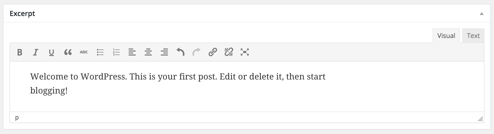

# Advanced Post Excerpt

[](https://travis-ci.org/stevegrunwell/advanced-post-excerpt)
[](https://codeclimate.com/github/stevegrunwell/advanced-post-excerpt)
[](https://codeclimate.com/github/stevegrunwell/advanced-post-excerpt/coverage)

[WordPress post excerpts](https://codex.wordpress.org/Excerpt) can be a great way to hand-craft the summary of your content. Unfortunately, writing post excerpts isn't as nice of an experience as what you find elsewhere in WordPress. Want to include links in your excerpts, or bold some text? Hopefully you know some HTML!

Advanced Post Excerpts is designed to change that, by giving your editors an easy, intuitive interface for writing great post excerpts.




## Configuration

Advanced Post Excerpt is designed to work out of the box, but is easily customized via [the WordPress Plugin API](https://codex.wordpress.org/Plugin_API):

### Filter: ape_editor_settings

Filter the settings passed to wp_editor() for the post excerpt.

For a full list of options, see [`wp_editor()`](https://codex.wordpress.org/Function_Reference/wp_editor).

<dl>
	<dt>(array) <code>$settings</code></dt>
	<dd>Settings for wp_editor().</dd>
</dl>

#### Example

If you'd like to disable the "Visual" and "Text" tabs, you can do so by setting the `quicktags` option:

```php
/**
 * Remove Quicktags from Advanced Post Excerpt.
 *
 * @param array $settings Settings for wp_editor().
 * @return array The filtered $settings array.
 */
function mytheme_disable_quicktags_on_excerpt( $settings ) {
	$settings['quicktags'] = false;

	return $settings;
}
add_filter( 'ape_editor_settings', 'mytheme_disable_quicktags_on_excerpt' );
```

### Filter: ape_post_types

Control the post types that should get the Advanced Post Excerpt meta box.

<dl>
	<dt>(array) <code>$post_types</code></dt>
	<dd>Post types affected by Advanced Post Excerpt.</dd>
</dl>

#### Example

If you'd only want the native "post" post type to use Advanced Post Excerpt, you could add the following to your theme's functions.php file:

```php
/**
 * Restrict Advanced Post Excerpt to the "post" post type.
 *
 * @param array $post_types Post types affected by Advanced Post Excerpt.
 * @return array A restricted version of $post_types containing only "post".
 */
function mytheme_restrict_ape_post_types( $post_types ) {
	return array( 'post' );
}
add_filter( 'ape_post_types', 'mytheme_restrict_ape_post_types' );
```
